# Universal Project Template — Next.js + Vibe Coding

Projekt-Template für **Next.js 16**-Anwendungen mit AI-gestütztem Development.
Liefert Struktur, Qualität und Dokumentation von Anfang an — optimiert für Claude Code, Cursor, Copilot & Co.

## Tech Stack

| Kategorie | Technologie |
|---|---|
| **Framework** | Next.js 16 (App Router) + React 19 |
| **Sprache** | TypeScript (Strict Mode) |
| **Styling** | Tailwind CSS v4 + shadcn/ui (New York) |
| **Animationen** | Framer Motion |
| **Icons** | Lucide React |
| **Linting** | ESLint + Prettier (Tailwind Class Sorting) |
| **Build** | Turbopack (Dev) |

---

## Schnellstart

> Windows: Scripts in **Git Bash** ausführen (nicht cmd.exe).

```bash
# 1. Template auf GitHub: "Use this template" → neues Repo erstellen
git clone <dein-repo>
code .

# 2. Template initialisieren (setzt Platzhalter)
bash scripts/init-template.sh

# 3. Dependencies installieren
npm install
npx shadcn@latest init

# 4. PROJECT_BRIEF.md ausfüllen
# Dann: docs/workflow.md gegenlesen und `.claude/agents/requirements-engineer.md` starten

# 5. Entwicklungsserver starten
npm run dev
```

## Ablauf auf einen Blick

```mermaid
flowchart LR
	A[PROJECT_BRIEF.md ausfuellen] --> B[docs/workflow.md gegenlesen]
	B --> C[Requirements Engineer]
	C --> D[docs/requirements/REQUIREMENTS.md]
	D --> E[Solution Architect]
	E --> F[docs/ARCHITECTURE.md]
	F --> G[Developer-Phase in src/]
	G --> H[QA Engineer]
	H --> I[docs/reports/TEST_REPORT.md]
	I --> J[Code Reviewer]
	J --> K[Gatekeeper]
```



Die Referenz fuer den Ablauf bleibt [docs/workflow.md](docs/workflow.md). Die Grafik ist nur die Kurzfassung fuer den Einstieg.

---

## Vibe Coding: `vibe/` vs `src/`

Klare Trennung zwischen **Exploration** und **Produktion**:

| | `vibe/` | `src/` |
|---|---|---|
| **Zweck** | Prototypen, Spikes, schnelle Ideen | Stabiler, getesteter Produktionscode |
| **Qualität** | Quick & Dirty erlaubt | Muss sauber sein |
| **Deployment** | Wird nie deployed | Geht in Produktion |

**Promote to `src/`, wenn:**
- Code wird mehr als einmal genutzt
- Feature ist fertig / soll deployed werden
- Stabilität ist nötig (Bugfixes, Refactoring)

---

## AI/Agent-Integration

### PROJECT_BRIEF.md

Zentrales Intake-Dokument fuer den Start jedes Projekts.
Workflow: **Ausfuellen → `docs/workflow.md` gegenlesen → Requirements Engineer ueber `.claude/agents/requirements-engineer.md` starten.**

Kanonische Folgeartefakte:
- `docs/requirements/REQUIREMENTS.md`
- `docs/ARCHITECTURE.md`
- `docs/reports/TEST_REPORT.md`
- `docs/DEVLOG.md`
- `docs/DECISIONS.md`

### Agent-Personas (8)

Spezialisierte Rollen unter `.claude/agents/`:

| Agent | Aufgabe |
|---|---|
| **Requirements Engineer** | Analysiert Brief und erstellt `docs/requirements/REQUIREMENTS.md` |
| **Solution Architect** | Architektur, Datenmodell, API-Design |
| **Frontend Developer** | UI-Komponenten, Pages, Layouts |
| **Backend Developer** | Server-Logik, APIs, Import-Pipelines und Library-Code |
| **Database Engineer** | DB-Schema, Migrations, ORM |
| **QA Engineer** | Testplanung, Testausfuehrung und `docs/reports/TEST_REPORT.md` |
| **Code Reviewer** | Code-Reviews nach Best Practices |
| **Gatekeeper** | Quality-Gate vor Merge |

### Installierte Skills (5)

| Skill | Beschreibung |
|---|---|
| **next-best-practices** | Next.js App-Router-Patterns, RSC-Grenzen, Datenmuster und Runtime-Regeln |
| **vercel-react-best-practices** | React Performance (Vercel offiziell, 57 Regeln) |
| **tailwind-v4-shadcn** | Tailwind v4 + shadcn/ui Setup & Migration |
| **framer-motion** | Animations-Performance (42 Regeln) |
| **conventional-commit** | Commit-Message-Format |

Die kanonische Skill-Quelle ist `.agents/skills/`.
Kompatibilitaetspfade wie `.claude/skills/` und `skills/` verweisen auf denselben Skill-Bestand.

### Regeln (AGENTS.md)

`AGENTS.md` ist die zentrale Navigations- und Regeldatei fuer Rollen, kanonische `docs/`-Pfade, Handoffs und Projektkonventionen.

---

## npm Scripts

| Script | Befehl |
|---|---|
| `npm run dev` | Entwicklungsserver (Turbopack) |
| `npm run build` | Produktions-Build |
| `npm start` | Produktionsserver |
| `npm run lint` | ESLint |
| `npm run lint:fix` | ESLint mit Auto-Fix |
| `npm run format` | Prettier auf alle Dateien |
| `npm run format:check` | Prettier-Check (CI) |
| `npm run typecheck` | TypeScript-Prüfung |

---

## Qualitätssicherung

```bash
# Quality Gate vor Merge (Format, Lint, Typecheck, Test, Build)
bash scripts/ship-safe.sh

# Mit Dependency-Installation
INSTALL_DEPS=1 bash scripts/ship-safe.sh
```

- **CI/CD**: GitHub Actions Pipeline auf Push/PR, nutzt `ship-safe.sh`
- **Pre-commit**: 6 Hooks (Whitespace, EOF, YAML, JSON, Merge-Conflicts, Private Keys)
- **VS Code**: Format-on-Save + ESLint Auto-Fix vorkonfiguriert

---

## Projektstruktur

```
├── .agents/skills/          # 5 Skills (Quelldateien)
├── .claude/agents/          # 8 operative Agent-Rollen
├── .github/workflows/       # CI/CD Pipeline
├── docs/
│   ├── ARCHITECTURE.md      # Tech Stack & Projektziel
│   ├── DECISIONS.md         # Architektur-Entscheidungen
│   ├── DEVLOG.md            # Session-Logs
│   ├── Templatestructur.md  # Vollständige Verzeichnisstruktur
│   ├── workflow.md          # Kanonischer Ablauf und Handoffs
│   ├── requirements/
│   │   └── REQUIREMENTS.md  # Fachliche Anforderungen
│   ├── reports/
│   │   └── TEST_REPORT.md   # QA-Ergebnisse und Teststatus
│   ├── knowledge/           # Obsidian-Wissensnotizen und Templates
│   └── team-doku/
│       └── Repo-Template-Beschreibung.md  # Detaillierte interne Template-Beschreibung
├── scripts/                 # ship-safe, init-template, debug-helper, update-devlog
├── tests/                   # Unit-, Integrations- und weitere Tests
├── tools/                   # Hilfsprogramme, Konverter und Utilities
├── data/                    # Samples, Fixtures und Korrekturen
├── src/                     # Produktionscode
├── vibe/                    # Prototypen & Spikes
├── AGENTS.md                # AI/Agent-Regeln
├── PROJECT_BRIEF.md         # Projekt-Briefing (ausfüllen!)
├── package.json             # Dependencies & Scripts
└── tsconfig.json            # TypeScript Strict Mode
```

> Vollständige Struktur mit allen Dateien: siehe [docs/Templatestructur.md](docs/Templatestructur.md)

---

## Dokumentation pflegen

| Datei | Wann aktualisieren |
|---|---|
| `docs/DEVLOG.md` | Nach jeder relevanten Arbeitseinheit |
| `docs/DECISIONS.md` | Bei wichtigen "Warum?"-Entscheidungen |
| `docs/requirements/REQUIREMENTS.md` | Wenn sich fachliche Anforderungen aendern |
| `docs/ARCHITECTURE.md` | Bei Stack-Änderungen |
| `docs/reports/TEST_REPORT.md` | Wenn QA-Artefakte oder Testergebnisse erwartet sind |

```bash
# DEVLOG automatisch aktualisieren (mit letzten Commits)
bash scripts/update-devlog.sh
```

---

## Platzhalter ersetzen

| Datei | Platzhalter |
|---|---|
| `PROJECT_BRIEF.md` | `___` (alle Felder) |
| `LICENSE` | `<YOUR NAME/ORG>` |
| `SECURITY.md` | `<SECURITY_EMAIL>` |
| `package.json` | `"name": "my-next-app"` |
| `docs/ARCHITECTURE.md` | Projektziel, Erfolgskriterien |

> `bash scripts/init-template.sh` setzt die meisten Platzhalter automatisch.

---

## Lizenz

[MIT](LICENSE) — siehe Datei für Details.
